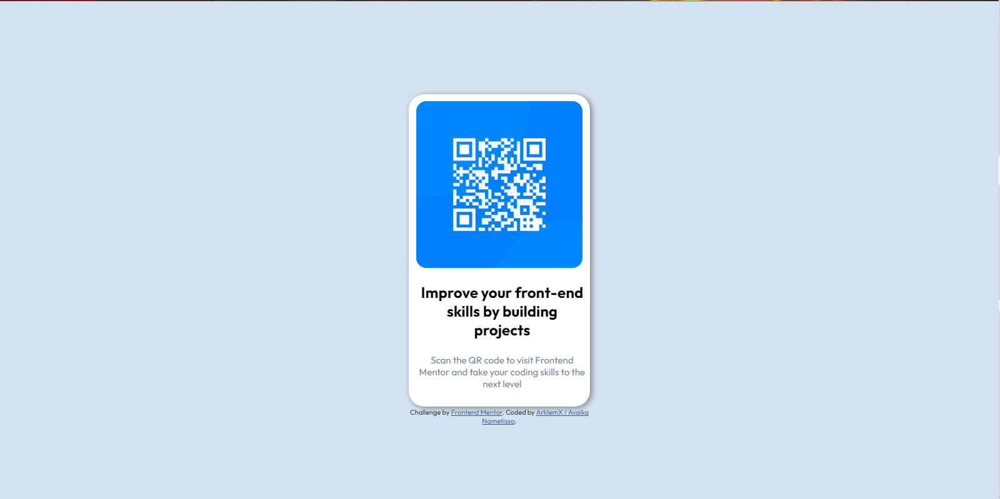
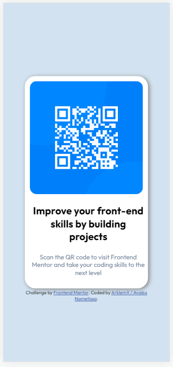

# Frontend Mentor - QR code component solution

This is a solution to the [QR code component challenge on Frontend Mentor](https://www.frontendmentor.io/challenges/qr-code-component-iux_sIO_H). Frontend Mentor challenges help you improve your coding skills by building realistic projects. 

## Table of contents

- [Overview](#overview)
  - [Screenshot](#screenshot)
  - [Links](#links)
- [My process](#my-process)
  - [Built with](#built-with)
  - [Continued development](#continued-development)
  - [Useful resources](#useful-resources)
- [Author](#author)

## Overview
### Screenshot

### Links

- Solution URL: [My Solution, Right Here](https://github.com/ArklemX/qr-code-component-main-2m)
- Live Site URL: [The Solution, in LIVE](https://arklemx.github.io/qr-code-component-main-2/)

## My process

  To reach the end of this Challenge, i made it like this :
- Structure With HTML: I begun by making the structure of the product. I think that it is much simple. 
- Style With CSS : Next , i continuously adjusted the CSS to reach the goal i'd.
### Built with

- Semantic HTML5 markup
- CSS custom properties
- Flexbox

### Continued development

Right now , i know i still have to learn about

- FlexBox

### Useful resources

- [How_to_center_the_card_?]( https://css-tricks.com/quick-css-trick-how-to-center-an-object-exactly-in-the-center/ ) - This helped me to understand how i could actually center my center. I really liked this pattern and will use it going forward. Right now, the card is on the center of the screen , regardless of the device.
- [FlexBox](https://yoksel.github.io/flex-cheatsheet/) - This is an amazing sheet cheat which helped me finally understand how to work with Flexbox. I'd recommend it to anyone still learning this concept:). 

## Author

- Frontend Mentor - [@AklemX](https://www.frontendmentor.io/profile/ArklemX)

Thanks ! X)